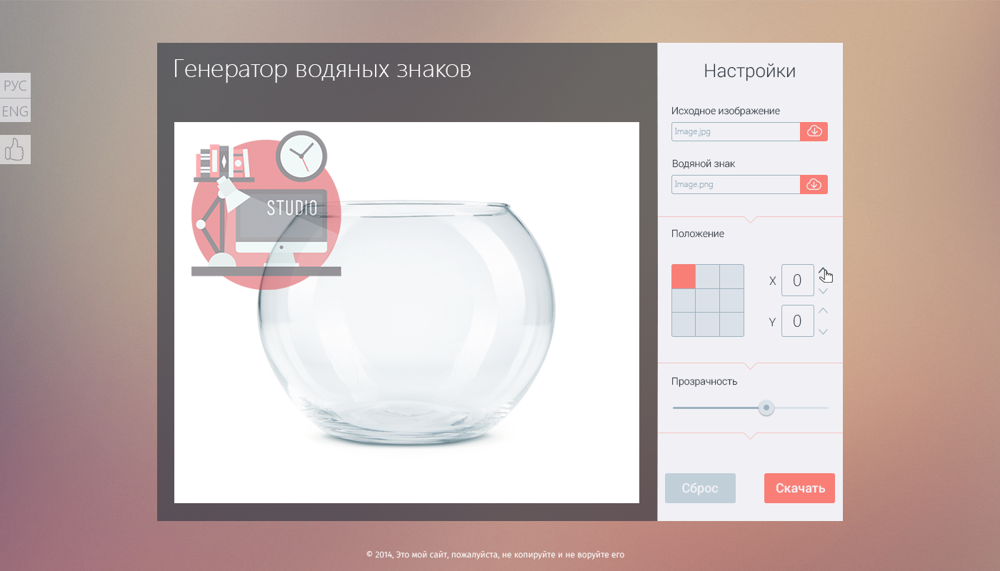

#Watermark

Сервис по созданию водяных знаков на изображениях.

Перейти на [сайт](http://example.net/) проекта.
Перейти на [GitHub](http://example.net/) проекта.

### Описание

>Сервис поможет защитить авторское право на фотографии и изображения, размещённые в сети, посредством накладывания водяного знака.

### Начало работы

>Перед началом работы активной будет только форма для загрузки исходного изображения, используйте форму:

>

>Следующим шагом будет загрузка картинки в качестве водяного знака, используйте форму:

>

### Управление расположением

>После загрузки обеих картинок, становятся доступными формы управления положением и степенью прозрачности водяного знака.
С помощью кнопок, на рисунке ниже, можно выбрать метод размещения водяного знака. Справа - режим одиночной копии водяного знака. Слева - замощение с определенным расстоянием между копиями водяного знака.

>

### Одиночный водяной знак

>Для размещения одиночного водяного знака относительно исходного изображения, используйте кнопки управления:

>

>для более точного позиционирования:

>

### Замощение водяного знака

>Для замощения водяного знака относительно исходного изображения, используйте кнопки управления:

>
крестик будет отображать реальную толщину расстояния между копиями по горизонтали и вертикали.

### Сброс действий

>Для отмены всех произведенных действий нажмите кнопку:

>

>В данном случае картинки вернутся в исходное положение, поля ввода значений очистятся.

### Скачивание готового результата

>Если результат Вас устраивает, нажмите кнопку:

>

>Картинка скачается на Ваш компьютер в папку для скачивания по умолчанию.

###Установка

1. git clone https://github.com/visermort/watermark.git
2. cd watermark
3. npm install
3. bower install
4. Для установки Gulp 4.0 глобально команда npm i -g git+https://git@github.com/gulpjs/gulp.git#4.0
5. gulp clean
6. gulp copy
7. gulp
8. В адресной строке браузера команда http://localhost:3000

###Команда разработчиков

|  Имя    | работа в проекте     |  GitHub    | Email     |
| :----------- | :----------: | :----------- | :----------: |
| Андрей Спартак | Тим-лид | [visermort](https://github.com/visermort) |<me@example.com> |
| Стелиос Багларидис | front-end | [steliosbox](https://github.com/steliosbox) |<me@example.com> |
| Лейсан Гильфанова | js | [Allarepossible](https://github.com/Allarepossible) |<me@example.com> |
| Тимофей Дяденко | php | [tim44](https://github.com/tim44) |<me@example.com> |
| Алексей Егоров | front-end | [ego-web](https://github.com/ego-web) |<ego_web@mail.ru> |

